# 23 Design Patterns:
1. Creational: creation of objects
2. Structural: Class structure such as inheritance and composition
3. Behaviorial: Interaction between objects

### Creational:
1. Singleton - Restricts the initilization of a class to ensure that only one instance of the class can be created
2. Factory - Takes out the responsibility of instantiating an object from a class to a Factory class
3. Abstract Factory - Factory for factory classes
4. Builder - Creating an object step-by-step and returning it
5. Prototype - Forking an object into our requirements

### Structural:
1. Adapter - Interface between two unrelated entities so that they can work together
2. Composite - Used to implement a part-whole hierarchy
3. Proxy - Provide a surrogate / placeholder for another object to control access it
4. Flyweight - Caching & Reusing object instances, used with immutable objects.
5. Facade - Creating a wrapper interfaces on top of existing interfaces
6. Bridge - Decouple interfaces from implementation (abstraction)
7. Decorator - Modify the functionality of an object during runtime

### Behavioral:
1. Chain of Responsibility - Used to achieve loose coupling in software design where a request from client is passed to a chain of objects to process them
2. Command - Used to implement loose coupling in a request-response model
3. Interpreter - defines a grammatical representation for a language and provide an interpreter to deal with this grammar
4. Iterator - Used to provide a standard way to traverse through a group of objects
5. Mediator - Used to provide a centralized communication medium between different objects in a system
6. Memento - Used when we want to save the state of an object so that we can resolve later on
7. Observer - used to notify any change in the state of an object
8. State - Used when an object change its behaviour based on its internal state
9. Strategy - Used when we have multiple algorithms for a specific task and client decides the actual implementation to be used at runtime
10. Template Method - Used to create a template method stub and defer some of steps of implementation to subclasses
11. Visitor - Used when we have to perform an operation on a group of similiar kind of objects

## Singleton:
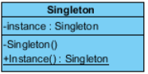<br>
Ensures only one instance of a class is present globally
Used in Facade, Builder, Abstract Factory, Prototype
Application: Logging, Thread Pool

Implementation requires-
1. Private constructor to restrict instantiation of the class from other classes
2. Private static variable of the same class that is the only instance of the class
3. Public static method that returns the instance of the class, which acts as the global access point for the object

This implementation is thread-safe.
```
package com.journaldev.singleton;

public class ThreadSafeSingleton {

    private static ThreadSafeSingleton instance;

    private ThreadSafeSingleton(){}

    public static ThreadSafeSingleton getInstanceUsingDoubleLocking() {
        if (instance == null) {
            synchronized (ThreadSafeSingleton.class) {
                if (instance == null) {
                    instance = new ThreadSafeSingleton();
                }
            }
        }
        return instance;
    }

}
```

## Factory
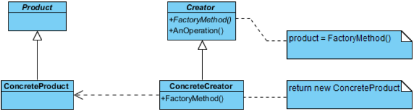<br>
Used when we have a superclass with multiple subclasses and based on input we need to return one of the subclass.
Say we have a superclass __A__, and its child classes __B__ & __C__:

```
public class Factory {
    public static A getA(int choice, *args, **kwargs) {
        switch(choice) {
            case B:
                return new B(*args, **kwargs);

            case C:
                return new C(*args, **kwargs);
        }
        return null;
    }
}
```

## Abstract Factory:
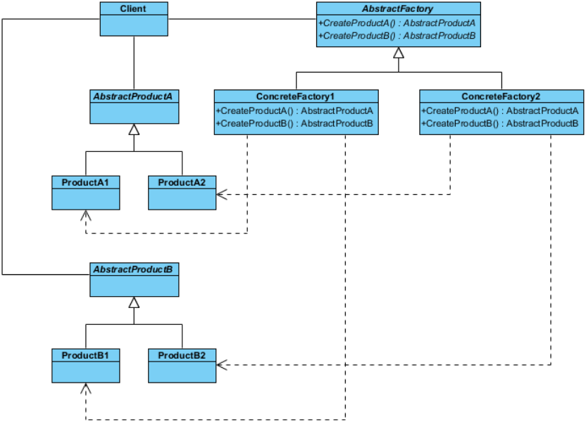<br>
We have a factory class for each sub-class
So the abstract factory class will return the subclass based on input factory class
It is easy to accomodate more types than Factory

```
public interface ComputerAbstractFactory {
    public Computer createComputer();
}

public class ComputerFactory {
    public static Computer getComputer(ComputerAbstractFactory factory) {
        return factory.createComputer();
    }
}

public class PC extends Computer {

}

public class PCFactory extends ComputerAbstractFactory {
    public Computer createComputer() {
        return PC();
    }
}

public class Server extends Computer {

}

public class ServerFactory extends ComputerAbstractFactory {
    public Computer createComputer() {
        return Server();
    }
}

/// ComputerFactory(new PCFactory());
/// ComputerFactory(new PCFactory());
```

## Builder:
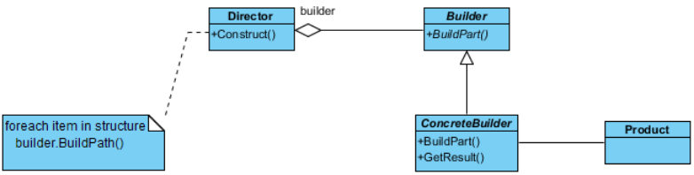<br>
Too many arguments are passed from Client to create objects
We incorporate a builder to construct complex objects step-by-step
We can use a director which can provide further diversity of the objects

```
public interface IBuilder {
    public addStuffA();
    public addStuffB();
    public getProduct();
}

public class BuilderA implements IBuilder {
    public addStuffA() {

    }

    public addStuffB() {

    }
}

public class BuilderB implements IBuilder {
    public addStuffA() {

    }

    public addStuffB() {

    }
}

public class Director {
    public constructAA(builder: IBuilder) {
        builder.addStuffA(1);
        builder.addStuffB(2);
    }

    public constructBB(builder: IBuilder) {
        builder.addStuffA(1);
        builder.addStuffB(2);
    }
}

/// Director director = new Director()
/// IBuilder builderA = new BuilderA()
/// IBuilder builderB = new BuilderB()
/// director.constructAA(builderA);
/// Product product = builderA.getProduct()
```

## Prototype:
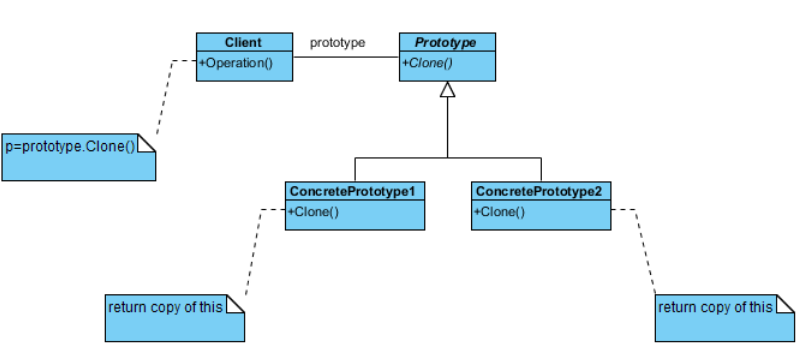<br>
Used when object creation is costlier than just copying a similar object (eg we want to copy a large database)

```
abstract class Shape {
    abstract Shape clone();
    /// rest of the functions
}

public class Rectangle extends Shape {
    public Shape clone() {
        return new Rectangle(this);
    }
}
```

## Adapter:
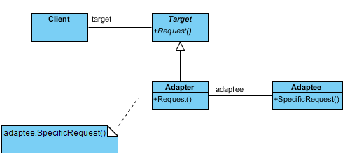<br>
Used when two interfaces are incompatible, so we have an adapater which can bridge them both

```
public class Volt {
    public int volt {get; set;}
}

public class Socket {
    public Volt getVolt() {return new Volt(120);}
}

public interface ISocketAdapter {
    public Volt get120Volt();
    public Volt get10Volt();
    public Volt get30Volt();
}

public class SocketAdapter implements ISocketAdapter {
    public Socket socket = new Socket();

    public Volt get120Volt() {}
    public Volt get10Volt() {}
    public Volt get30Volt() {}

    private Volt convertVolt() {
        /// voltA to voltB
    }
}
```

## Composite:
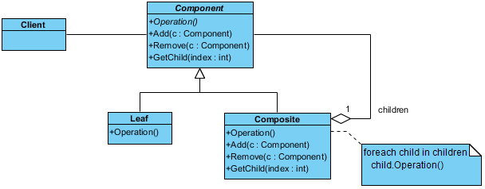<br>
Composes objects into tree structure (build an objects using other smaller objects)
Useful only in cases when the application can be modeled as a tree
We have a common interface for both leaves and nodes
```
public interface Component {
    public void execute();
}

public class Leaf implements Component {
    public void execute() {

    }
}

public class Node implements Component {
    public List<Component> childern;

    public void add(Component child) {

    }

    public void remove(Component child) {

    }

    public List<Component> getChildern() {

    }

    public void execute() {

    }
}
```

## Proxy:
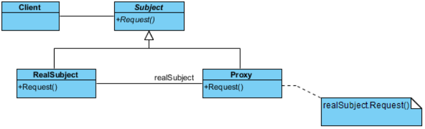<br>
To provide appropriate control over a class to the client/other classes

```
public interface IService {
    public void operation();
}

public class Service implements IService {
    public void operation() {

    }
}

public class Proxy implements IService {
    private Service realService;

    public Proxy(Service s) {
        bool accessApproved = checkAccess();

        if accessApproved {
            realService = s;
        }
        else {
            realService = null;
        }
    }

    public bool checkAccess() {

    }

    public void operation() {
        if realService != null {
            realService.operation();
        }
        else {
            throw Exception;
        }
    }
}
```

## Flyweight:
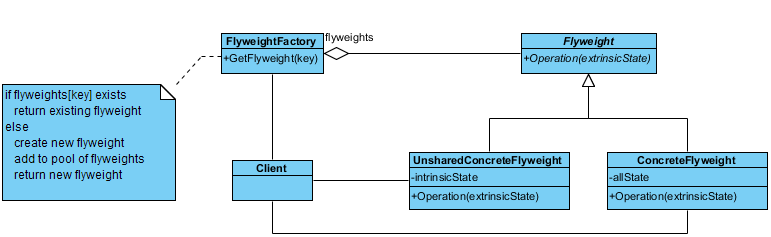<br>
Use sharing to support large number of fine-grained objects efficiently (in terms of time and space)

The object properties are divided into 2 types:
1. Intrinstic - constant data of an object (repeating)
2. Extrinstic - changing data of the object (unique)

We should pass the extrinstic state to specific methods that use it instead of storing it within the object. Only the intrinstic state stays with the object, which allows us to reuse it.

We can store the extrinstic state in a context class which stores the reference to the particular flyweight and the extrinstic state

Flyweight Factory:
It manages a pool of existing flyweight objects

```
public class Flyweight {
    private internalA, internalB;

    public Flyweight(fieldA, fieldB) {
        internalA = fieldA;
        internalB = fieldB;
    }

    public execute(externalC, externalD) {

    }
}

public class FlyweightFactory {
    private static Collection<Flyweight> flyweights;

    public static getFlyweight(internalA, internalB) {
        flyweight = flyweights.find(internalA, internalB);
        if flyweight is null {
            flyweight = new Flyweight(internalA, internalB);
            flyweights.add(flyweight);
        }
        return flyweight;
    }
}

public class Context {
    private externalD, externalC;
    private Flyweight flyweight;

    public Context(externalA, externalB, flyweight) {

    }

    public execute() {
        flyweight.execute();
    }
}

public class ContextAggregate {
    private Collection<Context> objects;

    public createObject(externalC, externalD, internalB, internalA) {
        flyweight = FlyweightFactory.getFlyweight(internalA, internalB);
        object = new Context(externalC, externalD, flyweight);
        objects.add(object);
    }

    public execute() {
        for object in objects {
            object.execute();
        }
    }
}
```

## Facade:
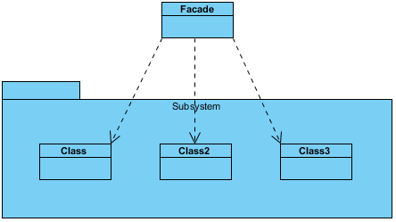<br>
Provides a simplified interface to a set of classes
```
public class TextDatabase {
    private database;

    public void upsert(data) {

    }

    public void remove(pointer) {

    }
}

public class ImageDatabase {
    private database;

    public void upsert(data) {

    }

    public void remove(pointer) {

    }
}

public class Database {
    private TextDatabase textdb;
    private ImageDatabase imagedb;

    public void upsert(data) {
        if type(data) is text {
            textdb.upsert(data);
        }
        else {
            imagedb.upsert(data);
        }
    }

    public void remove(pointer) {
        if type(data) is text {
            textdb.remove(data);
        }
        else {
            imagedb.remove(data);
        }
    }
}
```

## Template Method:
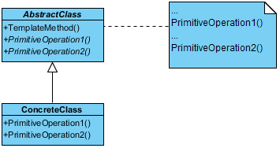<br>
Provides a skeleton for implementing a process, with explicitly mentioning the steps but leaving the actual implementation to the subclasses
```
abstract class SoftwareTemplate {
    final void buildSoftware() {  // final so that subclasses cannot override
        Gathering_requirements();
        Writing_specification_document();
        Architecture_and_Design();
        Development();
        Integration();
        Testing_and_Validation();
        Deployment();
        Maintainance();
    }
}
```

## Mediator:
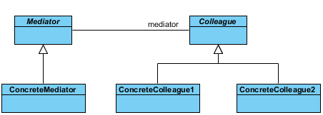<br>
Acts like a communicator between objects, where objects are only allowed to communicate with the mediator and not directly
```

```

## Chain of Responsibility:
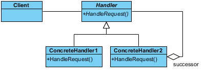<br>
Here we set an order of calling and execution between classes, where each class will define its successor; each class has two options: either handle a request or pass it on to its successor
```
interface IHandler {
    SetSuccessor(IHandler nextNode);
    Handle(Request);
}

class NodeInChain implements IHandler {
    private IHandler successor;

    public void SetSuccessor(IHandler nextNode) {
        successor = nextNode;
    }

    public void Handle(Request req) {
        ...
    }
}

class Program {
    private IHandler chain;

    void Program() {
        chain = NodeInChain();
        node2 = NodeInChain();
        chain.SetSuccessor(node2);
    }
}
```

## Observer:
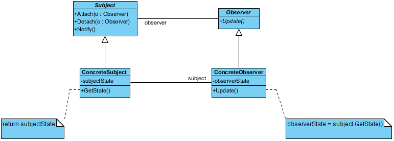<br>
Used when you are interested in the state of an object and you wish to get notified for the same
```
interface ISubscriber {
    void update(event);
}

class Publisher {
    private List<ISubscriber> subscribers;

    public void Notify(event) {
        for subscriber in subscribers {
            subscriber.update(event);
        }
    }

    public void AddSubscriber(ISubscriber subscriber) {
        subscribers.add(subscriber);
    }

    public void RemoveSubscriber(ISubscriber subscriber) {
        subscribers.remove(subscriber);
    }
}
```

## Strategy:
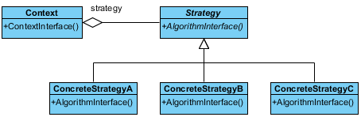<br>
Used when you have multiple algorithms to perform a task, so you make the client pass their desired choice.
```
interface IStrategy {
    void execute();
}

class Context {
    private IStrategy strategy;

    void SetStrategy(IStrategy strategy) {
        strategy = strategy;
    }

    void DoSomething() {
        strategy.execute();
    }
}

class ConcreteStrategy implements Strategy {
    void execute() {
        ...;
    }
}
```

## Command:
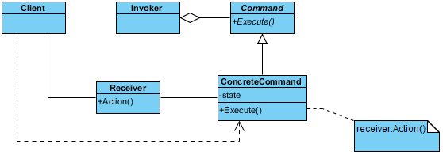<br>

## State:
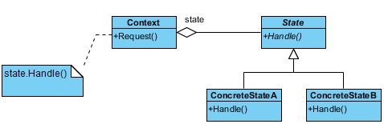<br>
An object could go through various states (like FSM), each state having different implementations of the same functions and identified by different properties. Create a class for each state.
```
interface IState {
    void MethodA();
    void MethodB();
}

class State1 implements State {
    void MethodA() {

    }

    void MethodB() {

    }
}

class Context {
    private IState state;

    void MethodA() {
        state.MethodA();
    }

    void MethodB() {
        state.MethodB();
    }

    void ChangeState(IState state) {
        state = state;
    }
}
```

## Visitor:
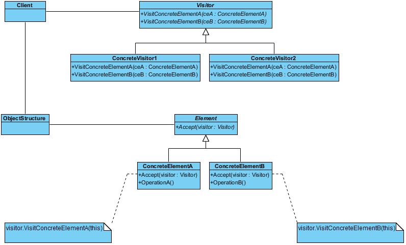<br>
Used when we have to perform an operation of a set of objects (whose classes cannot be modified); so we traverse/use the objects
```
interface IVisitor {
    visitA(ElementA);
    visitB(ElementB);
}

class ConcreteVisitor {
    visit(ElementA) {

    }

    visit(ElementB) {

    }
}

interface Element {
    accept(IVisitor v);
}

class ElementA {
    accept(IVisitor v) {
        v.visitA(ElementA);
    }
}
```

## Iterator:
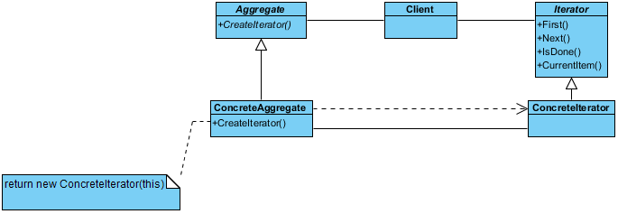
Lets you traverse a collection of objects without knowing its internal representation

