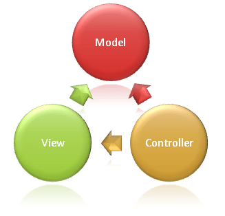

# GUI Programming

XML - Extensible Markup Language
XAML - Extensible Application Markup Language

## GUI Principles
1. Keep UI Thread responsive. Deleagate to worker threads to unblock the UI Thread
2. Access UI elements only on the UI thread

## UX Design Patterns
1. Model-View-Controller (MVC) 
2. Model-View-Presenter (MVP)
3. Model-View-ViewModel (MVVM)

| MVC | MVP | MVVM |
|:-----|:-----|:------|
|   UI and Model are tightly coupled | UI and Model are loosely coupled | data bindings so easy seperation|
| Controller and View have one-to-many relationship | Presenter and View have one-to-one relationship | ViewModel and View have one-to-many relationship |
View has no knowledge about Controller | View has references to the Presenter | View has references to ViewModel |

### Model View Controller
Controller gives input to Model (user queries) and View (which view to display)
View gives input to the Model (user actions)
User requests are routed to Controller which is reponsible for working with Model for handling queries. The Controller instructs the View to display to the user and provide Model any data it needs

Model has proper business logic
View presenting content
Controller connects View and Model

### Model View Presenter
Derivative of MVC
Presenter is alias to Controller
Instead of having view directly interacting with model, it interacts only with the presenter

#### Data Binding
Binds and synchronises data source from provider and consumer together

### Model View ViewModel
ViewModel is a mediator which automates the communication between View and Model through Data Binding
